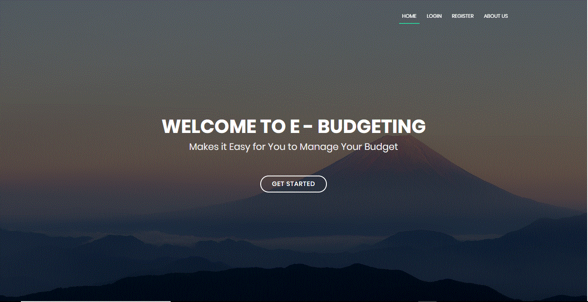

## Judul Aplikasi
E-Budgeting 

Web Apps For Manage Your Company Finace using Laravel

## Setup
Sesudah menclone, setelah itu lakukan composer install untuk menginstall vendor yang ada pada laravel

## Screenshot

## Database 
untuk database gunakan perintah php artisan migration

## Contact
Interested untuk mengembangkan aplikasi serupa? Hub. dickymujantara@gmail.com